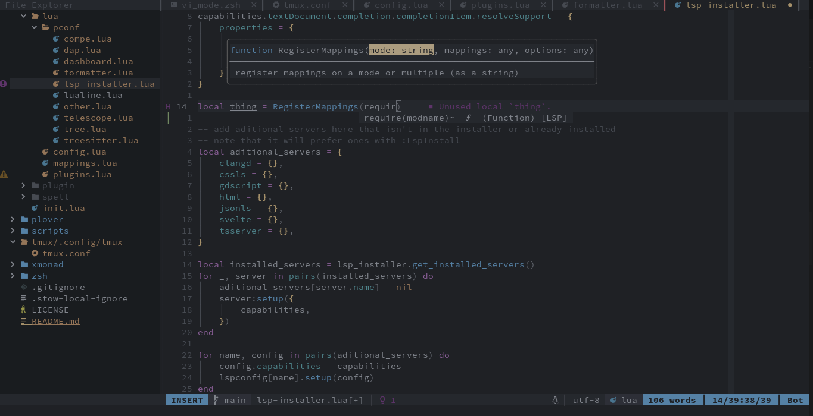
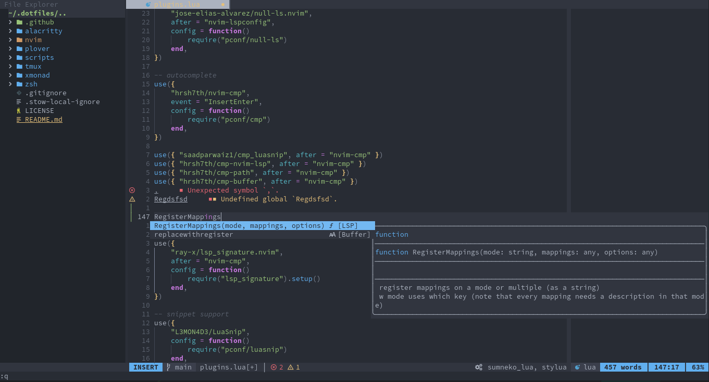
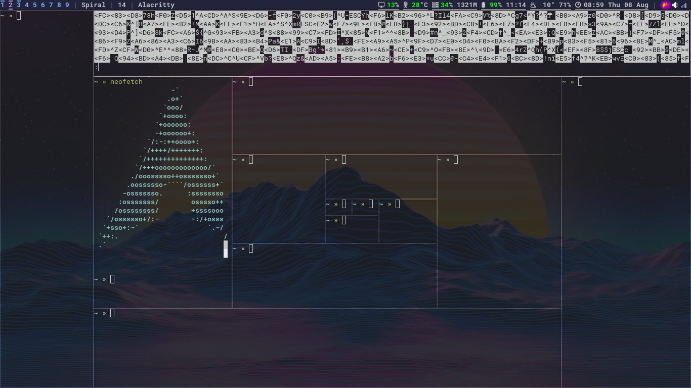
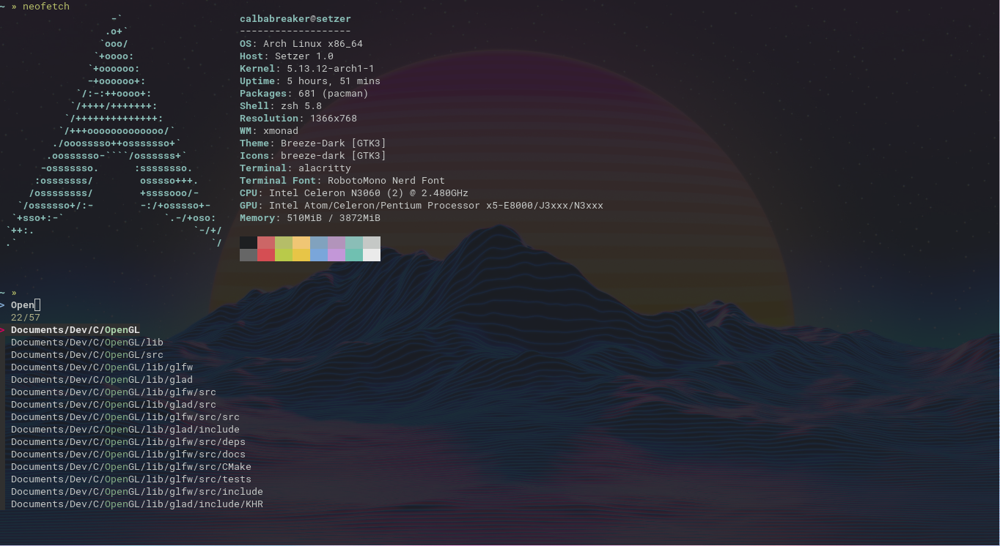

# Dotfiles

Cool dot files for neovim, zsh, xmonad, and alacritty and other random programs

## Setup

First you need to have git and GNU stow installed.
Then clone the repository:

```sh
git clone https://github.com/Calbabreaker/dotfiles ~/.dotfiles --depth=1
cd ~/.dotfiles
```

Now you can individually choose to use a dotfile config (specified by a folder) like so:

```sh
stow zsh # zsh configurations
stow nvim # NeoVim configurations
```

NOTE: The plover directory **shouldn't** be ran with stow; run `plover/setup.sh` instead.

To remove a dotfile:

```sh
stow -D zsh
stow -D scripts
```

## NeoVim

Note: Requires NeoVim >= 0.5 and probably only works on unix.

To set up NeoVim (after stowed) run `:PackerSync` in NeoVim.





By default no language servers or treesitter parsers are installed.
Install a treesitter parser using `:TSInstall language-name` (e.g. `:TSInstall javascript`)
and language server using `:LspInstall language-server` (e.g. `:LspInstall tsserver`).
Press tab to see options.

[Prettierd](https://github.com/fsouza/prettierd) is needed to format
JavaScript, HTML, CSS, etc. files, (install with `npm install -g @fsouza/prettierd`)
and clang-format is needed to format C++, C files.

Run `:W` to see keybinds (there are a lot). Some basic keybinds are: `C-e`
opens file explorer, `C-t` opens terminal.

Might need to install `xsel` to make NeoVim work with system clipboard.
`ripgrep` is needed in order to use telescope.

## Xmonad

Requirements (pacman):

```
sudo pacman -Sy xmonad xmonad-contrib xmobar dmenu xorg picom nitrogen trayer volumeicon dunst \
    xdotool network-manager-applet lightdm lightdm-gtk-greeter light-locker xorg-xbacklight --needed
```

You also need to stow the scripts directory:

```
# from .dotfiles
stow scripts
```



## Alacritty and zsh



Note: install Source Code Pro Nerd Font (using `yay -S nerd-fonts-source-code-pro`)
